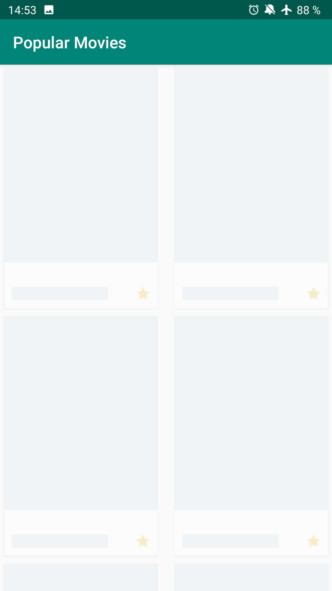
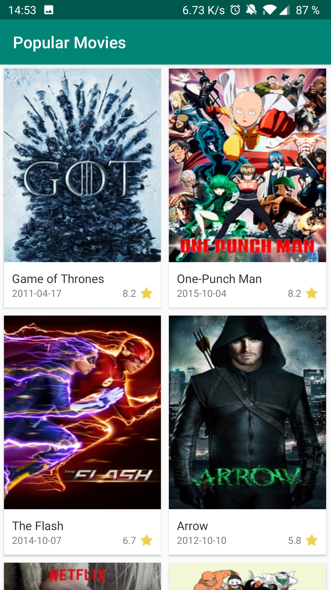

# Movies Challenge





This is an example application of a List using MovieDB Api. This application will show a list of cards about all the Popular movies in the MovieDB Api.

## Libraries

* CardView 28.0.0
* RecyclerView 28.0.0
* Retrofit 2.1.0
* ButterKnife 8.1.0
* Picasso 2.71828
* jUnit 4.12
* Mockito 2.6.8
* Facebook Shimmer Effect

## Gradle dependencies
```
dependencies {
    implementation fileTree(dir: 'libs', include: ['*.jar'])
    implementation 'com.android.support:appcompat-v7:28.0.0'
    implementation 'com.android.support:cardview-v7:28.0.0'
    implementation 'com.android.support:recyclerview-v7:28.0.0'

    /*
    Facebook Shimmer loading list
     */
    implementation 'com.facebook.shimmer:shimmer:0.4.0'

    /*
    Retrofit
     */
    implementation 'com.squareup.retrofit2:retrofit:2.1.0'
    implementation 'com.squareup.retrofit2:converter-gson:2.0.2'

    /*
    ButterKnife
     */
    implementation 'com.jakewharton:butterknife:8.1.0'
    annotationProcessor 'com.jakewharton:butterknife-compiler:8.1.0'

    /*
    Picasso Image Library
     */
    implementation 'com.squareup.picasso:picasso:2.71828'

    /*
    Test and Mock Libraries
     */
    testImplementation 'junit:junit:4.12'
    testImplementation "org.mockito:mockito-core:2.6.8"

    androidTestImplementation 'com.android.support.test:runner:1.0.2'
    androidTestImplementation 'com.android.support.test.espresso:espresso-core:3.0.2'
}
```

## MoviesDB Api Service

* API used: themoviedb.org V3 (you can check the api documentation [here](https://developers.themoviedb.org/3/getting-started/introduction))

* Endpoints used: "tv/popular"

## Apk Demo

You can download the application demo from this [link](https://play.google.com/)

## License

MIT License

Copyright (c) 2019 Marc Caps

Permission is hereby granted, free of charge, to any person obtaining a copy
of this software and associated documentation files (the "Software"), to deal
in the Software without restriction, including without limitation the rights
to use, copy, modify, merge, publish, distribute, sublicense, and/or sell
copies of the Software, and to permit persons to whom the Software is
furnished to do so, subject to the following conditions:

The above copyright notice and this permission notice shall be included in all
copies or substantial portions of the Software.

THE SOFTWARE IS PROVIDED "AS IS", WITHOUT WARRANTY OF ANY KIND, EXPRESS OR
IMPLIED, INCLUDING BUT NOT LIMITED TO THE WARRANTIES OF MERCHANTABILITY,
FITNESS FOR A PARTICULAR PURPOSE AND NONINFRINGEMENT. IN NO EVENT SHALL THE
AUTHORS OR COPYRIGHT HOLDERS BE LIABLE FOR ANY CLAIM, DAMAGES OR OTHER
LIABILITY, WHETHER IN AN ACTION OF CONTRACT, TORT OR OTHERWISE, ARISING FROM,
OUT OF OR IN CONNECTION WITH THE SOFTWARE OR THE USE OR OTHER DEALINGS IN THE
SOFTWARE.
